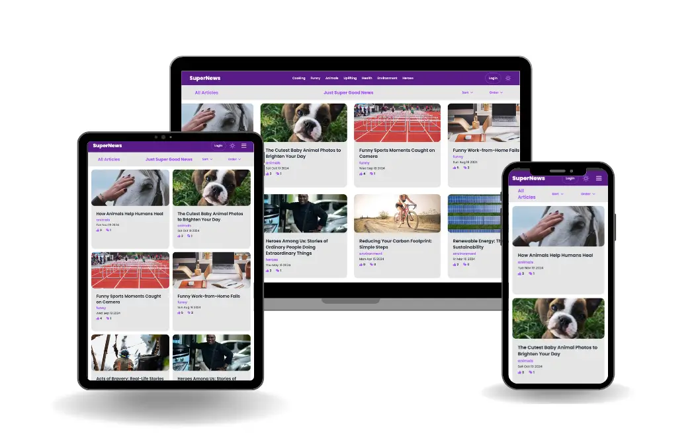

# Supernews

Supernews is a concept web application that focuses on delivering only positive news stories. It's a platform where users can share, read, and interact with uplifting content, creating a community-driven space for good news.
Please be aware that this is currently hosted on a free tier of Netlify and may experience slow loading times of up to 60 seconds.
This repo is for the react/vite frontend of the application. There is also a backend repo for the express/postgresql backend for this project and can be found here: https://github.com/sidendev/nc-news

## Features

- User-generated content: Stories are submitted by community members
- Voting system: Users can vote on stories they find most uplifting
- Comments: Engage in discussions about the news stories
- User profiles: Create your own profile to participate fully in the community
- Authentication: Secure sign-up and login process using Supabase

## Technologies Used

- React
- Vite
- Tailwind CSS
- DaisyUI
- Supabase
- React Icons
- Axios
- Netlify

## Getting Started

1. Clone the repository:
   Go to the Supernews GitHub repository page
   https://github.com/sidendev/supernews
   Click on the green "Code" button near the top-right of the page
   In the dropdown, copy the HTTPS URL it should look like
   https://github.com/sidendev/supernews.git
   Open your terminal or command prompt
   Navigate to the directory where you want to clone the project
   Run the following command, replacing the URL with the one you copied:
   git clone
   https://github.com/sidendev/supernews.git

   Once the cloning is complete, navigate into the project directory:
   cd supernews

2. Install dependencies:
   npm install

3. Set up environment variables:
   Create a `.env` file in the root directory and add your Supabase credentials:
   VITE_SUPABASE_URL=your_supabase_url
   VITE_SUPABASE_KEY=your_supabase_key

4. Start the development server:
   npm run dev

5. Open your browser and navigate to `http://localhost:5173` or other localhost address if specified in the terminal to access the application.

## Usage

1. Sign up or log in to your account (Note sign ups are disabled during development)
2. Explore the news stories and vote on your favorites
3. Leave comments on stories to engage with the community
4. Create your own profile to participate fully in the community

## Contributing

I'm not really looking for contributions at the moment, but if you'd like to fork the repo and make your own changes and expand upon it, that would be awesome!

## Status

This project is currently still in development and is not yet fully functional.

## Acknowledgments

- Thanks to the React, Vite, Tailwind CSS, DaisyUI, and Supabase docs/communities for their amazing tools and resources.
- Special thanks to the Northcoders community/trainers and my mentor for their support and guidance.

## License

This project is licensed under the MIT License.

This project was created as part of a Digital Skills Bootcamp in Software Engineering provided by Northcoders

Happy Supernews reading!
